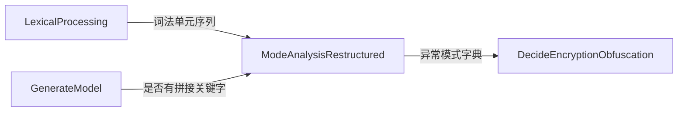

# 加密混淆JavaScript程序识别

作为恶意JavaScript文件的重要标志和攻击者常用的逃避检测手段之一，加密混淆的识别对于网络安全防护的加强有着重要的意义。本程序由Python 2编写的，用于识别加密混淆JavaScript程序。主程序输入为需要识别的文件的地址，以及一个JavaScriptKeywords文件（有提供），输出一个布尔值代表是否有加密混淆的情况存在。目前经过优化，可以达到识别准确率99%以上，误报率1%以下。

```
本文件依据Markdown格式编写，有条件请使用Markdown获得最佳的阅读体验
```

## 环境依赖

Python 2  
Jupyter

## 部署准备

运行/修改此项目需要安装下面的Python库：
numpy
matplotlib
pandas
Scipy
Scikit-learn
```
pip install matplotlib
pip install pandas
pip install scikit-learn
```

## 使用方法

```Python
from DecideEncryptionObfuscation import predict_obfuscation
predict_obfuscation('路径', '关键字路径')
```

## 目录结构描述

|—— README.md                              // 说明文档  
|—— 程序                                   // Python程序  
|&ensp;|—— DecideEncryptionObfuscation.py  // 主程序  
|&ensp;|—— ModeAnalysisRestructured.py  
|&ensp;|—— LexicalProcessing.py  
|&ensp;|—— GenerateModel.py  
|&ensp;|—— get_vector.py  
|&ensp;|—— Tesing.py                       // 各程序的调试程序  
|&ensp;|—— PlotResults.py                  // 对于各个模式进行可视化处理  
|—— 文档  
|&ensp;|—— 模式总结.docx                    // 模式说明文件  
|&ensp;|—— 加密混淆识别程序.pptx  
|—— 测试数据  
|&ensp;|—— Virus                           // 加密混淆文件  
|&ensp;|—— NormalProgrammes                // 正常文件  
|&ensp;|—— Experiment Data                 // 模式测试文件  
|—— 资料  
 &emsp;|—— 基础知识                         // 词法分析、语法分析原理  
 &emsp;|—— 论文                             // 有用的论文  

## 各组成部分详细介绍



### LexicalProcessing
#### 输入
文件地址、关键词地址
#### 处理
将输入的文件地址以字符串的形式读入。之后以自动状态机的形式进行词法分析，将文件中的词分为六类：字符串、正则表达式、数字、变量名、关键字以及符号，并在此过程中将字符串和变量名分离出来作为单独的数组返回。所有可数集合的词都拥有一个单独的序号，其他则为一个类一个序号，便于之后语法分析进行比较
#### 输出
词法单元序列、单词-序号映射、字符串序列、变量名序列、+/=占比、方括号占比（后两个为GenerateModel需要的参数）。

### GenerateModel
#### 版权声明
get_vector与GenerateModel由陈鹏远的Jupyter文件稍加改动转变而来，这里只做简单的功能介绍，具体内容请看文档目录下的readme_pengyuan.md。
#### 输入
异常函数调用计数、+/=占比、方括号占比、字符串序列
#### 处理
对输入的参数进行处理后进行机器学习，判断是否包含关键字拼接。
#### 输出
一个布尔值，此文件是否含有关键字拼接。

### ModeAnalysisRestructured
#### 输入
文件地址、关键词地址
#### 处理
将输入的文件先经过LexicalProcessing预处理，再对模式进行识别。在具体识别中，将需要相同输入的模式归为一类进行分析。
##### 压缩类
判断在1000个字符的缓冲区内换行符是否小于两个。
##### 字符串类
对字符串序列中的每一个字符串进行遍历，再对每一个字符串中的每一个字符进行遍历，对模式进行统计或计数分析。
##### 语法分析类（广义）
将所有此类的异常模式写成一个自动状态机，遍历词法单元序列中的每一个词法单元，传入每一个自动向量机进行异常模式判断。
##### 变量名类
对变量名序列中每一个变量名进行遍历，通过自定义函数、统计和计数进行异常模式判断
#### 输出
一个异常模式字典，键为每一个异常模式，值为1/0（是否有此异常模式）或此异常模式的计数或经过初步标准化后的值。

### DecideEncryptionObfuscation
#### 输入
文件地址、关键词地址
#### 处理
将文件地址和关键词地址作为ModeAnalysisRestructured的输入，得到一个异常模式字典。对其中的值进行标准化后，使用Scikit-learn的SVM函数进行学习和预测。
#### 输出
一个布尔值，此文件中是否含有加密混淆

## 机器学习思路
由于考虑到在异常模式字典中包含大量的二元数据（1/0，表示是否包含此二元数据），决定使用支持向量机（SVM）进行机器学习。
### 使用函数
具体实现中，使用了Scikit-learn提供的SVC函数（kernal='linear'）。如果之后学习集/测试集的数量增长到几十万个以上，可以考虑使用sklearn.LinearSVC()。
### 学习集/测试集
本项目使用的数据集为共约10000个带或不带加密混淆的文件组成，各占一半，测试时随机分隔作为学习集/测试集。
```
带加密混淆：测试数据/Virus 来源-导师童志明
不带加密混淆：测试数据/Normal Programmes 来源：https://github.com，经本人（邓博元）手动挑选后形成
```
### 初步测试结果
```
准确率>99%
误报率<1%
```

## 未来改进方向
### 分析
#### 明确定义加密混淆JavaScript
在很多正常的文件中也会使用一些加密混淆，目的是减少文件大小与防止抄袭。这些文件是否算加密混淆，加密混淆到怎么程度算是恶意加密混淆，这些还需要进一步的讨论。
#### 寻找更多模式
35个模式没有穷尽所有的JavaScript加密混淆模式，继续增加模式以提高准确率。
#### 分析加密混淆程序
很多攻击者会使用开源的加密混淆程序，如Dean Edward Packer。可以搜索使用率较高的开源加密混淆程序进行分析，总结出更有效的判断方式。
#### 阅读论文
加密混淆JavaScript识别目前是一个热门方向，有很多同行在这个方向上也做出了不少成果，可以参考他们的思路改进此项目。在资料/论文目录下收录了一些论文，可以参考。
### 程序
#### 完整语法分析
考虑为ModeAnalysisRestructured进行完整的语法分析。目前的语法分析是不完整的，进行完整的语法分析可能可以提高判断的准确率。
### 机器学习
#### 进一步增加学习集
10000个文件数目可能还是过低，可以考虑增加数据集。
#### 改进标准化模式
目前标准化是简单线性映射，可能存在更好的标准化模式。
#### 考虑试用其他机器学习模式
目前使用的是支持向量机，可以尝试其他模式进行机器学习。

## 作者
* **邓博元 Boyuan Deng** - *第一版作者* - 莱斯大学（Rice University）
* **陈鹏远 Pengyuan Chen** - *合作者* - 加州大学伯克利分校（University of California, Berkeley）
* **童志明** - *导师* - 安天科技（Antiy Technology）
